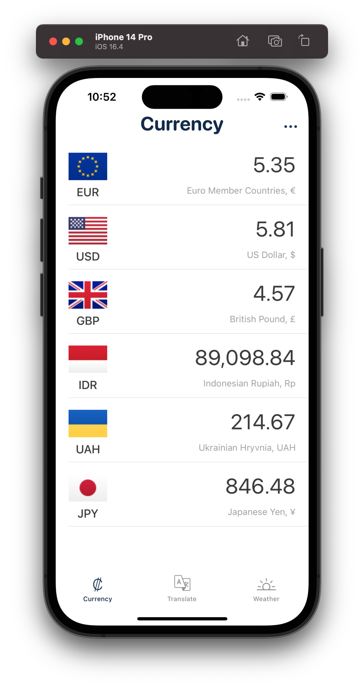
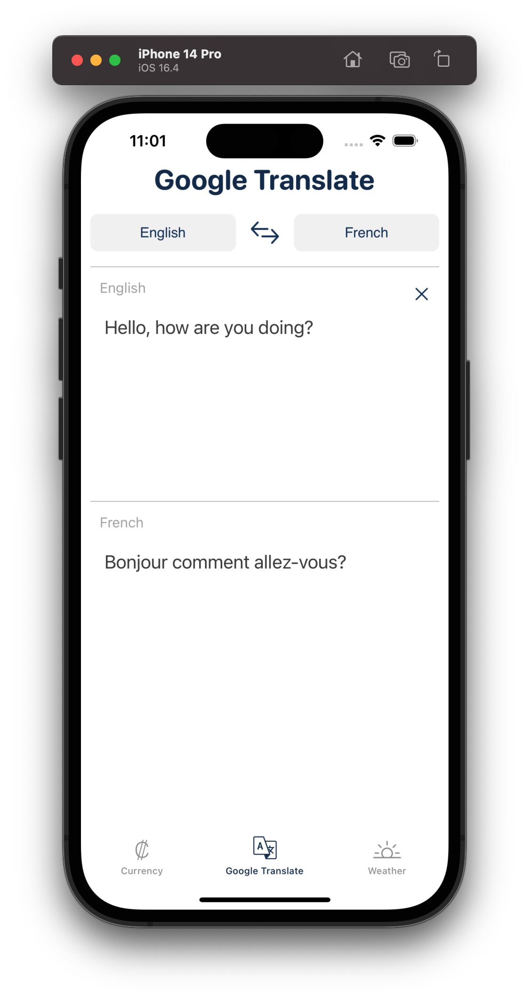
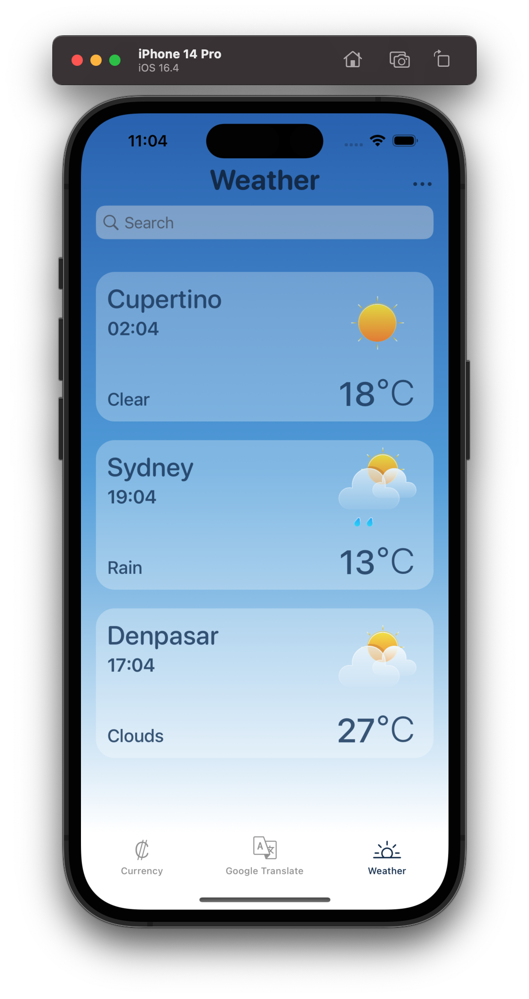
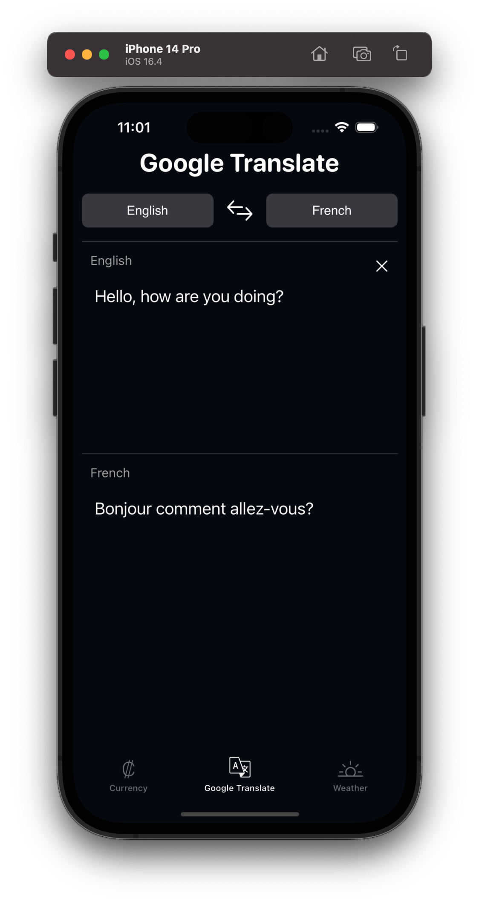
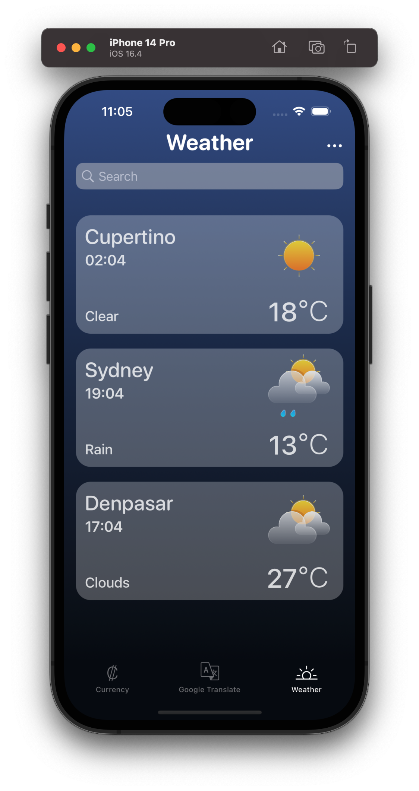

#  Backpack

A 3-in-1 application that allows you to:
* Convert any currency to another.
* Translate any supported languages.
* Compare the local weather with all your favorite places.

## Overview

<p align="center">



<br />



</p>

<br/>

## Table of Contents

<ol>
    <li><a href="#overview">Overview</a></li>
    <li><a href="#requirements">Requirements</a></li>
    <li><a href="#features">Features</a></li>
    <li><a href="#technologies-used">Technologies Used</a></li>
    <li>
      <a href="#getting-started">Getting Started</a>
      <ul>
        <li><a href="#prerequisites">Prerequisites</a></li>
        <li><a href="#installation">Installation</a></li>
      </ul>
    </li>
    <li><a href="#dependency">Dependency</a></li>
    <li><a href="#architecture">Architecture</a></li>
    <li><a href="#demo">Demo</a></li>
    <li><a href="#license">License</a></li>
  </ol>

<br/>

## Requirements

* iOS 15.0+

## Features

* 1st page: Currency (Exchange rates)
    * UX/UI inspired by the "Currency converter - Money" app.
    * List of the most traded currencies.
    * Personnal editable list to add or remove currencies.
    * Real-time currency conversion as you type an amount on the selected currency of your choice.
    * Applying SVG flags from [FlagKit](https://github.com/madebybowtie/FlagKit).
<br />

* 2nd page: Google translate
    * UX/UI inspired by the "Google Translate" app.
    * Write the sentence of your choice in any auto-detected language and receive its translation in another language of your choice.
    * The source/target language can be modified by selecting from a list of supported languages.
    * A search bar can also be used to facilitate your language selection.
    * Option to reverse source and target languages.
<br />

* 3rd page: Weather
    * UX/UI inspired by the official Apple weather app.
    * User-friendly search functionality.
    * Display weather information for any city of your choice.
    * The list is customizable for sorting, adding or removing loactions and converting Celsius to Fahrenheit.
    * High-quality SVG icons for most weather forecast senarios.
<br />

* Responsive Layout from the iPhone SE (3rd Generation) and subsequent versions.

## Technologies Used

* Design Tools: Figma.
* UX/UI: UIKit, via storyboard and code.
* Asynchronous Operations: DispatchQueue for multitasking.
* API Integration: fixer.io, Google Translate, Google Places and OpenWeatherMap.

## Getting Started
This application uses Install/Update [CocoaPods](https://guides.cocoapods.org/using/getting-started.html) to manage dependencies.

## Prerequisites
1. Visit [fixer.io](https://fixer.io/) or [APILayer](https://apilayer.com/marketplace/fixer-api) and subscribe to get a free Fixer API key.
2. Visit [Google API Console Help](https://support.google.com/googleapi/answer/6158862?hl=en) and follow the instructions to gain access to the Google Places and Google Translate APIs.
3. Visit [OpenWeather](https://openweathermap.org/) to obtain an API key (note that OpenWeather services now require payment, albeit at a low cost per request).

## Installation
1. Install required dependency (see below).
2. Open the project and create a new file named secrets.xconfig.
3. Add your own API keys in the following format:
```
GOOGLE_API_KEY = "YOUR_GOOGLE_API_KEY"
OPEN_WEATHER_API_KEY = "YOUR_OPEN_WEATHER_API_KEY"
FIXER_API_KEY = "YOUR_FIXER_API_KEY"
```

## Dependency
This application requires the pod [GooglePlaces](https://cocoapods.org/pods/GooglePlaces)

## Architecture
This project relies on MVC Architecture with a separate Network layer.

## Demo

<p align="center">


</p>

## License
See [LICENSE.md](LICENSE.md) for details
