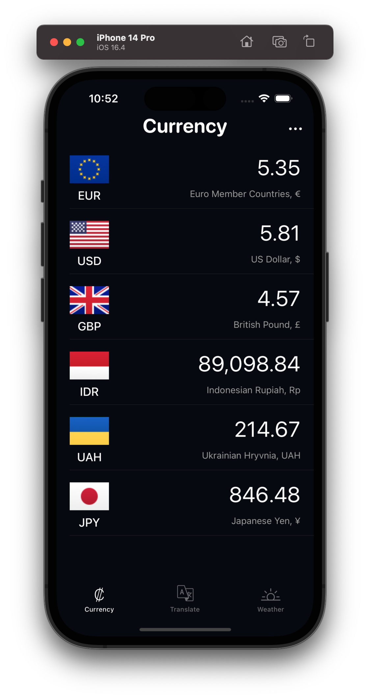

#  Backpack

A 3-in-1 application that allows you to:
* Convert any currency to another.
* Translate any supported languages.
* Compare the local weather with all your favorite places.

 

## Requirements

* iOS 14.7+

## Features

* 1st page: Currency (Exchange rates)
    * UX/UI inspired by the "Currency converter - Money" app.
    * List of the most traded currencies.
    * Personnal editable list to add or remove currencies.
    * Real-time currency conversion as you type an amount on the selected currency of your choice.
    * Applying SVG flags from [FlagKit](https://github.com/madebybowtie/FlagKit).
 

* 2nd page: Google translate
    * UX/UI inspired by the "Google Translate" app.
    * Write the sentence of your choice in any auto-detected language and receive its translation in another language of your choice.
    * The source/target language can be modified by selecting from a list of supported languages.
    * A search bar can also be used to facilitate your language selection.
    * Option to reverse source and target languages.
 

* 3rd page: Weather
    * UX/UI inspired by the official Apple weather app.
    * User-friendly search functionality.
    * Display weather information for any city of your choice.
    * The list is customizable for sorting, adding or removing loactions and converting Celsius to Fahrenheit.
    * High-quality SVG icons for most weather forecast senarios.
 

* Responsive Layout from the iPhone SE (3rd Generation) and subsequent versions.

## Technologies Used

* Design Tools: Figma.
* UX/UI: UIKit, via storyboard and code.
* Asynchronous Operations: DispatchQueue for multitasking.
* API Integration: fixer.io, Google Translate, Google Places and OpenWeatherMap.

## Usage

As user-friendly to use as the applications on which it is based.

## Installation

1. Clone or download the repository.
2. Install/Update [CocoaPods](https://guides.cocoapods.org/using/getting-started.html).
3. Install required dependency (see below).
4. Open the project in Xcode via Backpack.xcworkspace.
5. Add your own API keys for:
    - [fixer.io](https://fixer.io/)
    - [Google Places & Google Translate](https://support.google.com/googleapi/answer/6158862?hl=en)
    - [OpenWeather](https://openweathermap.org/)

## Dependency

* This application requires the pod [GooglePlaces SDK 7.3.0](https://cocoapods.org/pods/GooglePlaces)

## Architecture

* MVC Architecture with a separate Network layer.

## Demo

Coming soon...

## License

See [LICENSE.md](LICENSE.md) for details
